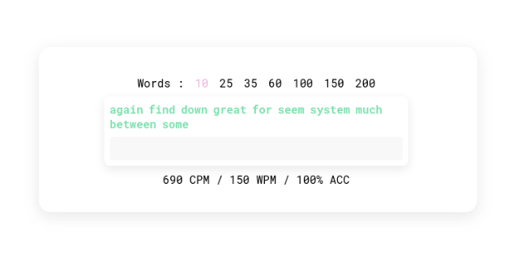

	<b>typer</b> 
	A very minimal online typing speed test
	

## Why does this exist

Essentially, I've never liked many typing tests, the few I like are
sites like [typings.gg](https://typings.gg) (which should be obvious by
the design), however it did not have CPM (characters per minute) and
only WPM (words), some may argue one is more accurate than the other.

However, I was bored, and was also annoyed about how every time I have
to tell somebody what speed I type at it won't work because said person
prefers CPM etc. So this solves that problem. Besides that Typer is
pretty if I do say so myself.

But I also wanna stress the "I was bored" part of this. I literally made
it in like 3½ hours, or at least the v1 of it. And I made it purely just
because I was bored. And because I wanted to. 

So here it is completely free and open source, and if you want you can
enjoy it over on my website: [typer.kiru.gay](https://typer.kiru.gay)

## The future of typer

I'm considering adding a time based test, more languages, and maybe
themes, however all of those sort of take away from the simplicity of
the project.
